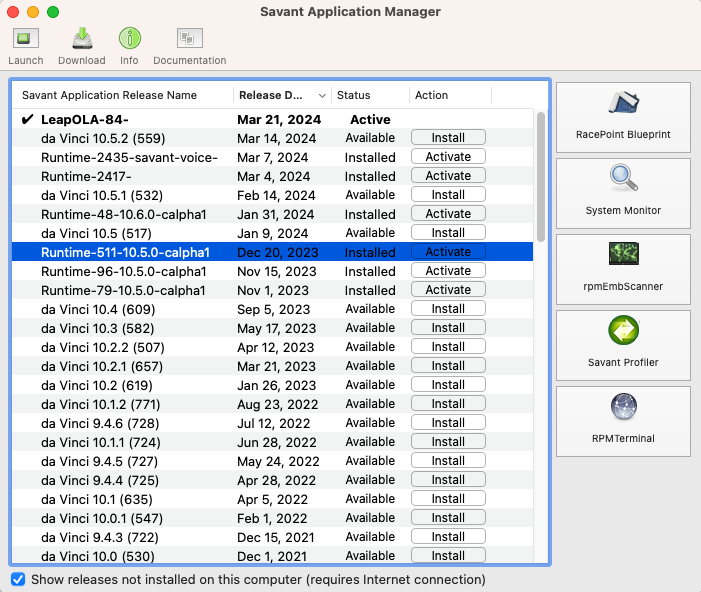
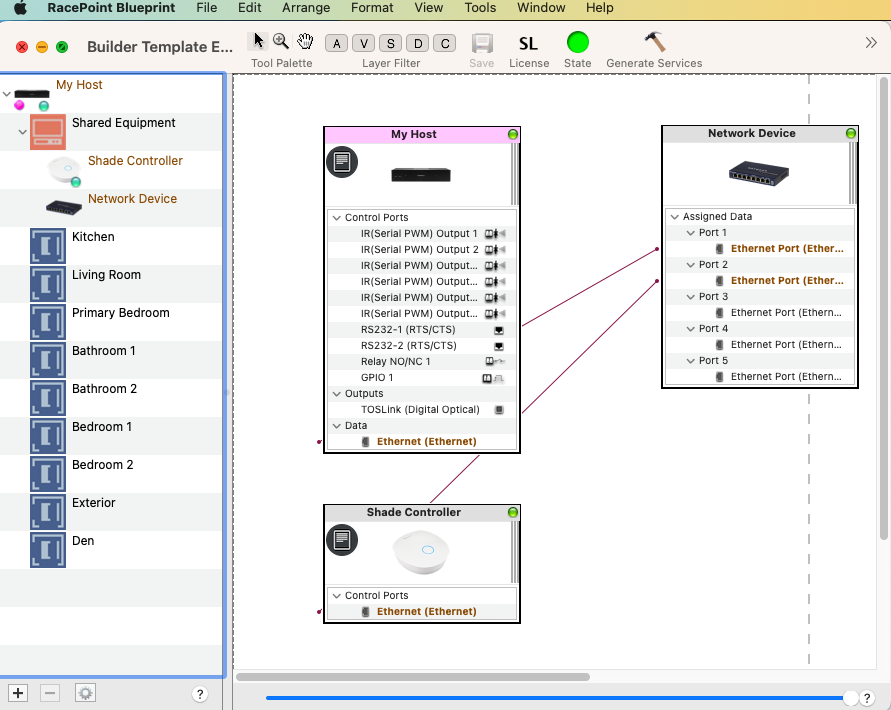
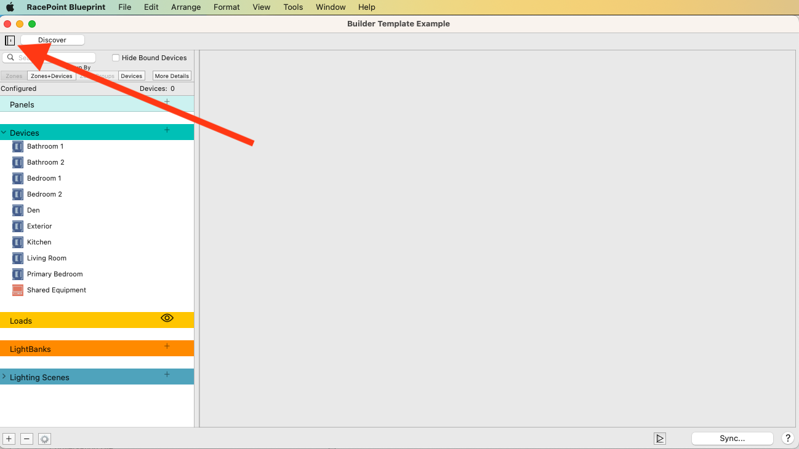
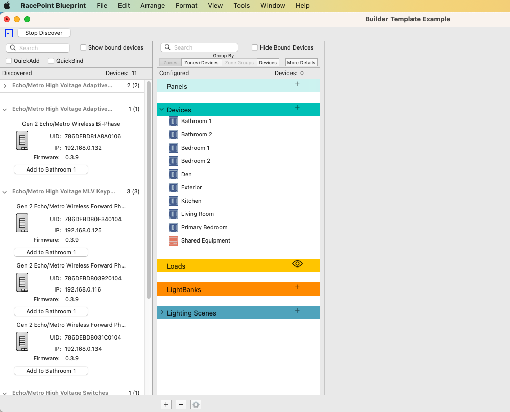
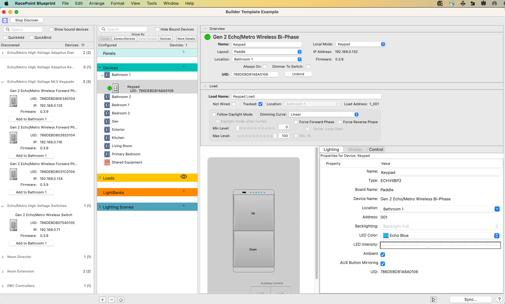
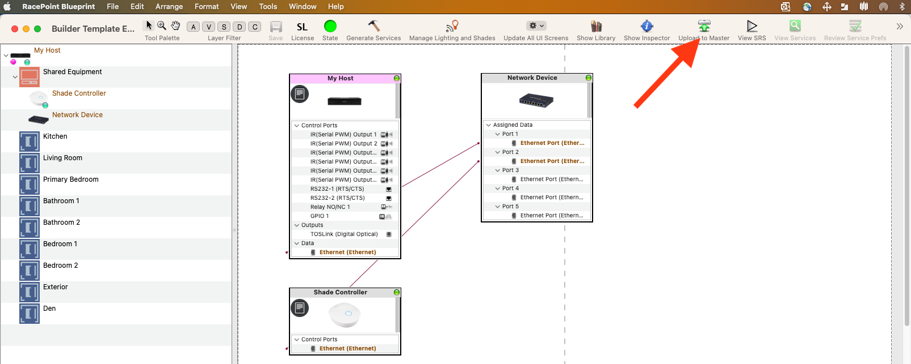

# Builder Quick Start Guide

## SAM 

* Open Savant Application Manager (SAM)  - /Applications/Savant Application Manager.app"
* 
* In SAM, Download latest daVinci Release (10.5.2), eventually SavantOS 11.0.  Make sure to remember to click the "Activate" button".

## Blueprint Loading of the Template
* Select the Blueprint icon (top right square) to open Blueprint
* Click File->"Open Template" then Navigate to /Users/shared/Builder/Builder Template Example"
* 
* Click File->"Save As..." and save the file to a unique name, to a Folder of your choice (Documents/MyBlueprintFiles)

## Discovery
* Press the slide out icon at the top right: 
* Then click Discover
* 
* Click Identify to flash the LEDs on the keypads.  Click button below icon in discovery column to add it to the select zone (select it first in the middle column).  Use Quick Bind or Quick Add here to onboard via button press from the keypad.
* 
* Finish adding all of the keypads into the rooms making sure you:
1. Make the Layout and Location correct
2. Select Always On if this keypads load will be controlling a load with Cync bulbs, strips and fixtures.
3. Give the Load name a unique name and if it is in a location other than the physical keypad, uncheck the "Tracked" checkbox. If it is not wired to a load then check the "Not Wired" checkbox.
4. Select the button and assign it to a previously created Scene, Lightbank or Load.
5. Click Sync.. at the bottom right then click Done.

## Save and Upload
* Hit Command-S to save this file.
* Now you want to upload the configuration to the host
* 

## Complete Guide

[Complete Wireless Lighting Deployment Guide](https://sav-documentation.s3.amazonaws.com/Product%20Deployment%20Guides/009-1807-00%20Wireless%20Lighting%20Deployment%20Guide.pdf){:target="_blank"}
