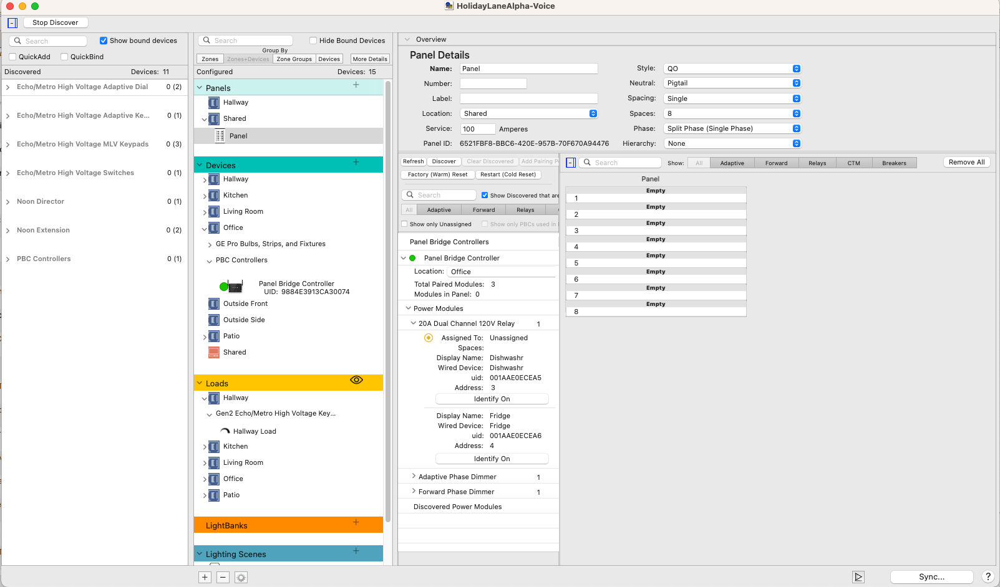
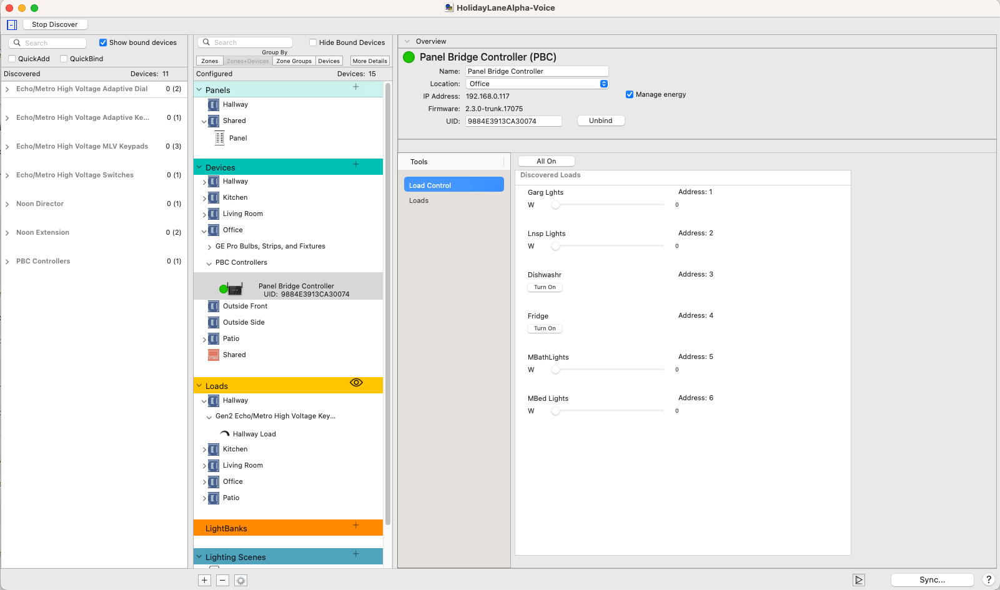
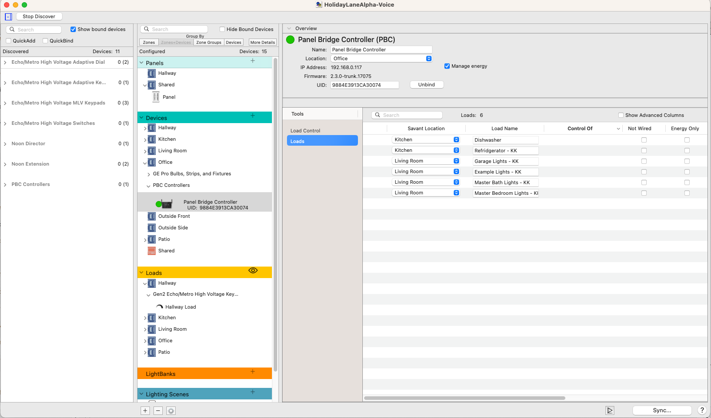

# Lighting

## Deployment Guides

* add them here

# Panels

1. After adding your PBC to the configuration (dragging from discovered to the correct zone in the configuration column), select the panel you would like to contain the modules that will be controlled.

2. Click Discover in the column to the left of the panel, to see the discovered PBCs as well as all of the CMs that it can see, via BLE.

3. Now drag the CM to the correct space in the panel to the right.

# PBC

## Header Definitions
- Savant Location
- Module Display
- Load Name
- Load Description
- User Interface Name
- Load #
- Fixture #
- Control of
- Not Wired
- Energy Only
- CT Size
- Group
- Identify
- Type
- Entity Address
- Panel Name
- Panel Label
- Panel Space

# DMX

# 0-10

# LEAP

