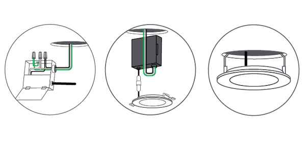
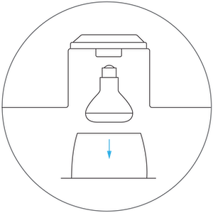

# Lighting

## Wall Box Dimmers 

ensure you have a neutral at the location you will be installing the dimmer, and turn off power before wiring any dimmers to prevent damage.

### Single Pole Locations
use the following wiring diagrams to physically install the dimmer or switch with a single control location that has a neutral.

### No Neutral Locations
use the following wiring diagrams to physically install the dimmer for a location that has no neutral

### 3/4-way Locations
Use the following wiring diagram to physicall install the dimmer or switch.  Note the location the dimmer should be installed and the location the "Slave" dimmers are installed

## Undercabinet Lighting
### Direct Wired
1. Remove the Knock-Out - Place a screwdriver into the center, carefully flexing back and forth until removed. Do not leave the removed metal circle inside the fixture.
    NOTE: Once the knock-out is removed, the Undercabinet Bar can only be hardwired and can no longer be plugged in.

    

1. Loosen the screw and remove connection cover.
2. Mount Strain Relief to the Connection Cover - Securely tighten the nut. Strain relief should be on the outside of the connection cover with the nut on the inside. Push supply cable through the strain relief ensuring that roughly 3 inches of cable is through the fitting. Tighten screws around supply cable.

    

3. Connect Wires - Inside the fixture, there are three wires with a wire connector fitted to each end. Carefully pull these out of the fixture. Do not pull with excesive force.
4. Insert each of the three wires from the supply cable into each of the three connectors with their respective color wires. Make sure that all wires are securely gripped, and no bare wires are exposed.
    NOTE:
    * Back plate may need to be removed for direct wire method for easier installation when using a thicker wire gauge.
    * Strip supply cable wires with wire strippers to expose 3/8 - 7/16 inches of bare metal for connection.
5. Gently push the wires back inide of the fixture. Secure the connection cover back onto the fixture assembly.
    WARNING: Do not use power cord when also direct wiring the fixture! Use only one method to power the fixture.

    

6. Install Fixture - Place the fixture in the desired position within 5 feet of an outlet. Ensure there is enough space between any cabinet edges and fixtures ends for the cord end. It may be required to pre-drill a pilot hole for screws using a 3mm or 1/8th inch sized drill bit.

    

7. Mount the fixture using a Philips head screwdriver, fully seating the pre-installed mounting screws. Provided screws are suitable for cabinet bottoms 3/8 inch or thicker. It may be required to pre-drill a pilot hole for the screws. WARNING: If using a drill, set it to a medium speed. Ensure the bit is fully engaged with the screw to avoid stripping. Start slowly until the screw bites into the wood.
8. Push in the screw hole covers, covering the two exposed screws. When direct wiring and not linking fixtures, make sure to not remove the plastic receptacle cap on each end of the fixture—leave them in place. Turn on the electricity at the circuit breaker or fuse box and verify that the fixture functions properly.
### Plug-In
1. Position Fixture - Locate the position to mount the Undercabinet Fixture. Be sure that it is mounted within 5 feet of an outlet.

    

1. Place the fixture in the desired position. Mount the fixture using a screwdriver, fully seating the pre-installed mounting screws. Provided screws are suitable for cabinet bottoms 3/8 inch or thicker. It may be required to pre-drill a pilot hole for the screws.
    WARNING: If using a drill, set it to a medium speed. Ensure the bit is fully engaged with the screw to avoid stripping. Start slowly until the screw bites into the wood.
1. Connect Fixture to Power Source - Remove the plastic quick connect cap that covers the INPUT port. Store the cap in a safe place for potential future use. Insert the power cord quick connector into the INPUT port.
1. Plug in the power cord to an electrical outlet. Secure cord using cable clips, making sure to keep cord snug to the mounting surface.
1. Push in the screw hole covers, covering the two exposed screws. Turn on the electricity at the circuit breaker or the fuse box and verify that the fixture turns ON.
### Joining Multiple Fixtures
1. For multiple fixture installation, make sure all fixtures have been securely mounted and AC Input ports are facing the same direction. (See image below) Fixtures are linkable up to a maximum of 10 units and a wattage maximum of 220W.

    

2. Remove the plastic quick connect cap that covers the INPUT/OUTPUT port. Store the cap in a safe place for potential future use.
3. Using provided jumper cord or recessed connector, link the fixtures together starting with the INPUT/OUTPUT port on the powered fixture and connecting it to the INPUT port on the non-powered fixture. The linking cable and flush connector are designed to only connect one way.

    

4. Ensure plastic quick connect caps are installed in all open parts at the completion of installation.
    NOTE: Fixtures can be controlled individually or grouped together in the Cync App whether they are joined together or powered independently.
## Wafer Lights
### Hard Wired
ensure the power is turned off on the ciruit before you begin working
Please reference this [Installation Guide](https://sav-documentation.s3.amazonaws.com/KB%20Imagery%20/Cync%20KB%20Imagery/Cync%20Documents/Install%20Guides/8646-46GE21_Cync%20Wafer%20Downlight%20Installation%20Guide%20Guide%20-%20012122-2%20(1).pdf) for complete instructions.

Installation and Wiring

### Recessed Can Install
1. Remove existing trim and bulb from the lamp you wish to replace with a Cync Recessed Can Downlight.

1. Screw the E26 base of the downlight into the existing socket. Then insert the connector into the E26 base.

1. Connectors: Mate the connector from the existing housing with the terminal directly on the fixture

1. Use the manufacturer's torsion springs for installation. These are pre-installed on the Cync Recessed Can Downlight.

1. Check that the torsion springs are firmly attached to the Cync Recessed Can Downlight. Compress torsion springs and insert into the bracket inside the housing. Release springs and gently push up until flush with the ceiling.

