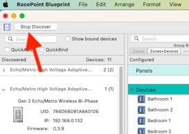
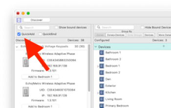

# Blueprint - Configuration Software

##Create a New Home
1. Open the template file
1. create Rooms or sometimes calles zones.
    1. Using the existing Rooms list you can edit the Rooms that are not being used and use them for new Rooms.
	1. Press the plus button at the bottom left to add another room.  Provide a name NOTE: You can only use a room name 1 time on a project.
1. generate services
1. Save as new project name

## Add Lighting
1. open lighting and shade manager
1. click on the drawer to open the discovery pane

    

1. click the discover button

    

1. Once all the devices have been discovered you will need to add them to the configuration.  To do this you will click on the "Quick Add" check box.

    

1. On the right side click on the room you wish to add your first keypad to

    

1. press the button on the keypad (the keypad should be identified and added to that room)
    1. As each device is placed name the Device location
	1. Name each lighting load
	1. Switches and dimmers by defacult will control the connected load.  You can change this now SCENE PROGRAMMING or you can return and update the button programming later.

    
	
1. Once all keypads have been placed in the proper rooms press the sync button in the lower right

    
	
1. Close the Lighting data table
1. Press the upload to host button (you should wait up to 5 minutes for all devices to get new firmware)

    

We are back with the earlier video.  This will show you how to do the above steps.

## Test with Savant App
1. Connect to the home using the Savant App
	1. [Apple iOS](https://apps.apple.com/us/app/savant/id1095325838)
	1. [Android](https://play.google.com/store/apps/details?id=com.savantsystems.controlapp.pro&hl=en_US)
1. Navigate to the Lighting serivce in the app and test the lights
1. Return to the program to make any changes necesary and upload again

We are back with the earlier video.  This will show you how to do the above steps.

## Create Scenes
Scenese are a group of lights being set to a predetermined level.  They can be set to be toggled on and off or set to just go on to a specific level.
To Create a scene 

[Wireless Lighting Deployment Guide](https://sav-documentation.s3.amazonaws.com/Product%20Deployment%20Guides/009-1807-00%20Wireless%20Lighting%20Deployment%20Guide.pdf) 

