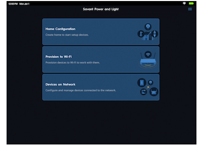
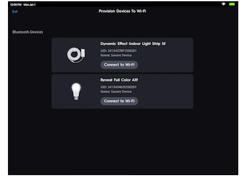
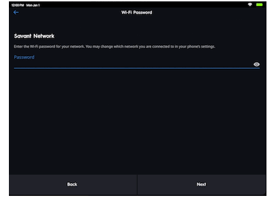

# Lighting
Pre-program the Savant lighting requires that you:

* Have a wireless network that is operational in the home.  Please ensure you know the network name (SSID) and the network password.
* All devices are installed and powered
* have Savant Power & Light app installed on your deivce

to Pre-Program the lighting you will need to first program the WiFi information into all the devices

**Keypads**

1. [Using the Savant Power & Light App connect 1 dimmer to the WiFi Network](#keypads)
1. [Using the RAD method have the 1st dimmer talk to the other dimmers in the house to get them connected to the network](#rad)

**Fixtures**

1. [Using the Savant Power & Light App connect each light fixture to the WiFi Network](#fixtures)

## Savant Power & Light App
Download the Savant Power and Light app from the [Apple App Store](https://apps.apple.com/us/app/savant-power-light/id1590957877) or [Google Play Store](https://play.google.com/store/apps/details?id=com.savant.cyncproconfig.release&hl=en)

### Keypads
1. Launch the app after downloaded

    This is a sub step

1. Ensure your device is on the wifi network you wish to connect the keypads to
1. Tap on the "Provision to Wifi button"
1. the app will search for installed devices that are powered on and within Bluetooth range (about 10')
1. tap on one of the devices and tap next
1. Select use current WiFi
1. Enter the wifi password
1. tap provision and the wifi information will be sent to the "Primary" keypad.  Close the app and continue to the next step RAD

Note: To make it easier to know what device is your "Primary" keypad.  We recommend you open the airgap on all other devices in the area to reduce the number of devices showing up durring the BLE scan step 4.
### Fixtures
1. Launch the app after downloaded
1. Ensure your device is on the wifi network you wish to connect the keypads to
1. Tap on the "Provision to Wifi button"

    

1. the app will search for installed devices that are powered on and within Bluetooth range (about 10')
1. tap on one of the devices and tap next

    

1. Select use current WiFi
1. Enter the wifi password

    

1. tap provision and the wifi information will be sent to the "Primary" keypad.  Close the app and continue to the next step RAD

NOTE: Repeat steps 4-8 for each lighting device.
The beginning of this video will walk you through the steps to provision or add devices to the WiFi network.  We will reference this video again later when the next parts are important.

## RAD
Using these steps you can use RAD at any time to connect additional or new keypads to the network using a "Primary" keypad that is already on the network.

1. Set the dimmer that is on the WiFi into RAD Primary mode
    1. Locate the service switch and open it to remove power from the switch
    1. Press and hold top left most button and press and hold it whil closing the airgap and powering the switch on
    1. continue to hold the button for 10 seconds when the button will start to blink white
    1. the LEDs at the top of the keypad will nightrider from the left to the right in white to let you know it is in RAD Primary mode.

1. set each dimmer that is not on the network yet into discovery mode.
    1. Press and hold the top left most button for 10 seconds when the button will start to blink red
    1. the LEDs at the top of the keypad will nightrider from the left to the right in red to let you know it is in RAD Subordinate mode.

1. Once complete you will need to Exit RAD mode on the keypads. This can be done 2 ways:
    1. Return to the first(Primary) keypad and press the reset button under the faceplate.  this will reset the keypad and exit RAD mode.  This will send a reset command to ALL RAD Subordinate keypads.
	1. Dimmers & Keypads will automatically exit RAD mode after 15 minutes of inactivity.  If you want to manually exit the mode use this.

the blinking lights will tell you when the WiFi has been learned.  Each device once they learn the WiFi network they will begin to broadcast the WiFi network to other devices in discovery mode.

* [Complete RAD Documentation and instructions](../content/RAD.pdf)