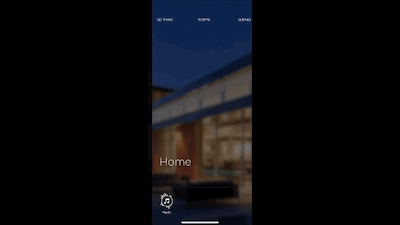
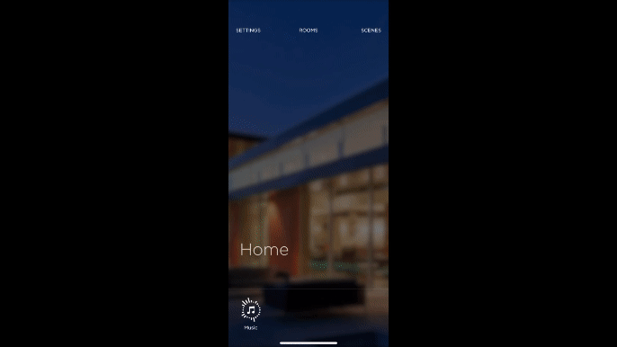
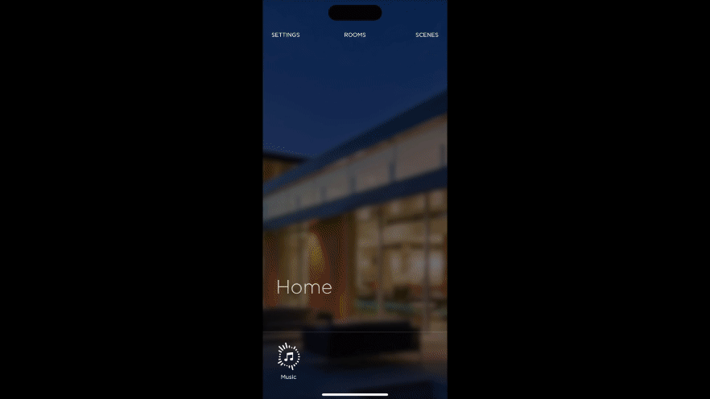

# Savant App
The Savant App is an award winning user interface for the Savant Ecosystem of products.  Please take the time to read this artical on how to complete the setup of the app to ensure the best experience for installers and customers.

  
## Get the App
* [Apple iOS](https://apps.apple.com/us/app/savant/id1095325838)
* [Android](https://play.google.com/store/apps/details?id=com.savantsystems.controlapp.pro&hl=en_US)
## Claim a home as admin
The first person that connects to a system will "Claim" the home and become the Admin for the home.  Other Admin's can be added to the system along with other users.  It is recommeded as an installer to have 1 "Admin" account for your company like service@electricalinstalls.com and all your employess log into this account.  This will ensure that all employees have access to all system that your compnay has deployed.
## Invite Other users (Home Owner)
### User Levels
* Admin
* Home
* Guest

To invite another user follow these steps:

1. Tap on the settings button in the upper left
1. Scroll down to users
1. Press the Plus icon in the upper right
1. choose the type of user you wish to add
1. Enter in thier email address
1. Tap Invite

    

## Add Pictures to the App
To Update pictures you have 2 locations under settings for the Home image and each of the room images.  Its important to update these to help the end user differentiate the rooms differently.  We recommend taking pictures of each room even if the rooms are not complete and the customer can allways update the images at any time.

### Home Picture
1. From the apps home screen enter the settings

    

1. Click on the camera on the home image to update the home image
### Room Pictures
1. Tap on the settings button in the upper left
1. scroll to room settings
1. select the room you wish to change
1. select a new image using the camera or media saved on your device.

    
## Scenes
Scenes can be used as a single button press to set many different things in the Savant system to a specific setting all at once or using timers.  Scenes are created per user but can be shared globaly in the system.

1. Tap on Scenes in the upper right
1. Tap on the plus icon in the upper right
1. Tap fast Capture if the settings in the home are already set how you want them and you wish to capture them or choose build if you want to choose things one by one and set them how you would like them to be
1. Once complete you can decide when the scene will trigger if you want it to have a count down or you can skip this step.
1. Tap Save

    
