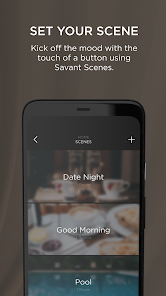
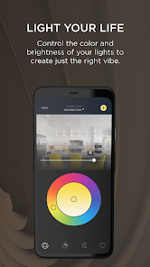
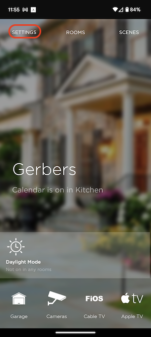

# Savant App
The Savant App is an award winning user interface for the Savant Ecosystem of products.  Please take the time to read this artical on how to complete the setup of the app to ensure the best experience for installers and customers.

  
## Get the App
* [Apple iOS](https://apps.apple.com/us/app/savant/id1095325838)
* [Android](https://play.google.com/store/apps/details?id=com.savantsystems.controlapp.pro&hl=en_US)
## Claim a home as admin
The first person that connects to a system will "Claim" the home and become the Admin for the home.  Other Admin's can be added to the system along with other users.  It is recommeded as an installer to have 1 "Admin" account for your company like service@electricalinstalls.com and all your employess log into this account.  This will ensure that all employees have access to all system that your compnay has deployed.
## Invite Other users (Home Owner)
### User Levels
* Admin
* Home
* Guest
## Add Pictures to the App
To Update pictures you have 2 locations under settings for the Home image and each of the room images.  Its important to update these to help the end user differentiate the rooms differently.  We recommend taking pictures of each room even if the rooms are not complete and the customer can allways update the images at any time.

### Home Picture
1. From the apps home screen enter the settings

2. Click on the camera on the home image to update the home image
### Room Pictures
2. 