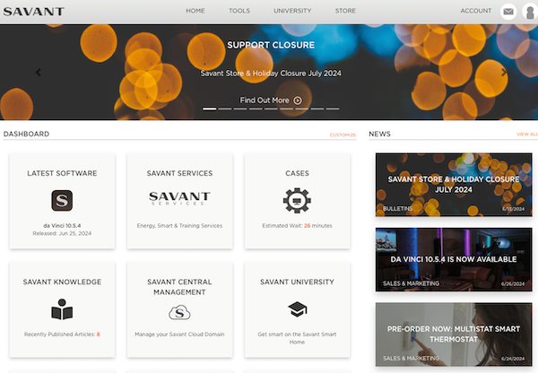
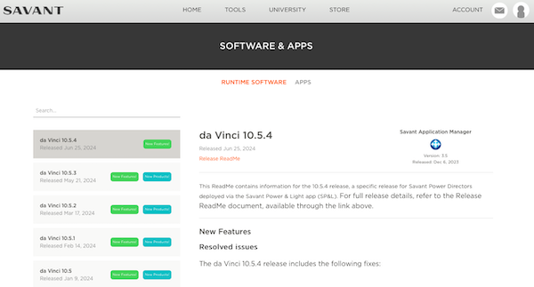
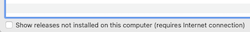
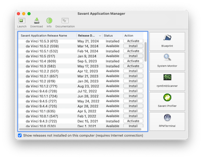

# Computer Setup
## New to MAC learn Here
[MacOS for Beginners](https://support.apple.com/guide/mac-help/get-started-with-your-mac-mchl3a2c2cb0/mac)

Here are some more specific MAC related items from our training team.

## Savant Application Manager - SAM

1. To download SAM you will need to log into the Savant communtiy at [community.savant.com](https://community.savant.com)

     

1. Once logged in navigate to the "Latest Software"

    

1. In the upper right you will have the option to download and install SAM
1. Double click on SAM from the download folder to install it
1. You may be prompted to remove old installation and please select that
1. Once SAM is open you will click on the "Show Release Not installed..." check box

    

1. Enter the same credentials you used on the savant community

    

1. Click on the "release date" to sort all the releases by the newest at the top
1. Click Install next to the Top Most Release
1. once the install is complete click "Activate"

**Optional**: Learn more about SAM and other Savant applications here

## Blueprint - Configuration Software
Blueprint is the configureation software.  This software runs on the computer and the host or "Savant Brain".  All your configuration will be done with this software.

To Prepare for your first configuration please use this [link]() to download the latest builder templates for the Blueprint Software

## System Monitor
System monitor is how you send your conifguration file to the Savant host.  You will not need to open this software as the Blueprint software will do this for you.