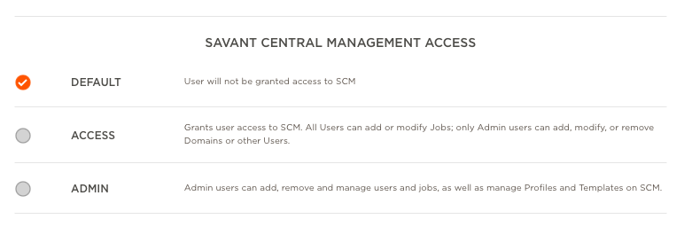
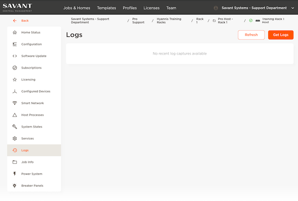

# Savant Central Management - SCM
## How to Access
SCM is Savant's Cloud Management Platform which can be accessed here [central.savant.com](https://central.savant.com)

You must configure access for empoloyees through the Savant Community [here](https://beta-community.savant.com/account?tab=personnel#contacts)

when adding or configuring users to access SCM you will need to provide them atleast DEFAULT level access as shown here

You can find more information on how to manage employees in this video

## Adding a Home
Each system that is installed must be added to SCM.  In order to do this you will need an admin using the Savant App to provide you with an access code.
To find the access code use these steps

1. Open the Savant App
1. Click on settings in the upper right corner
1. Scroll down to My Savant Dealer and click
1. Use this code to enter the information into the SCM website (This code is valid for aproximatly 5 minutes)

Once you have the access code you will enter this information into the Savant Central Management website.

1. Login to the SCM website
1. In the upper right corner click on the add button
1. Click on the Add Home option
1. Enter the code provided along with a name of the home so it can easily be identified in the list

Please see this video for a brief overview of the steps above.

## Using SCM
### Changing Configurations remotely
You can make changes to a system remotely by changing the configuration on your computer, uploading it to the SCM website and deploying it to the host.  This section will walk you through the steps to do this.

### Getting Logs for Support
At times there may be a need to supply Savant Support a set of system logs.  You can do this by accessing the SCM website and requesting the download of them.  This section will walk you though these steps.

1. Log into SCM
1. Locate the home you wish to download logs from
1. On the left side locate the "Logs" tab
1. Click the Get Logs Icon in the upper Right (NOTE: You must stay on this page until it completes the request)

    

1. The page will be refreshed and a log file will be listd on the page.  You can click download and then send this to the support team.
